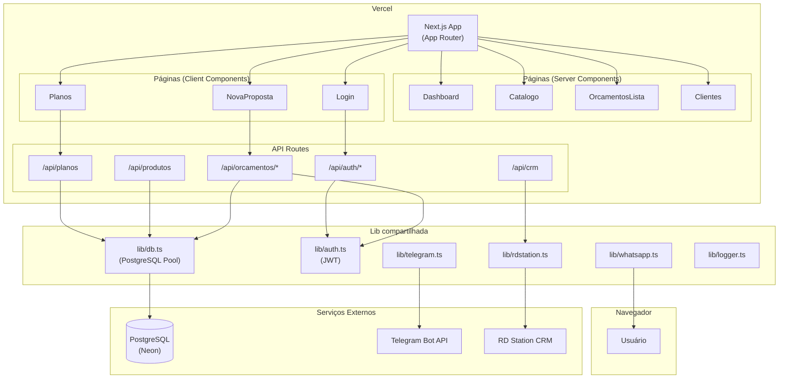
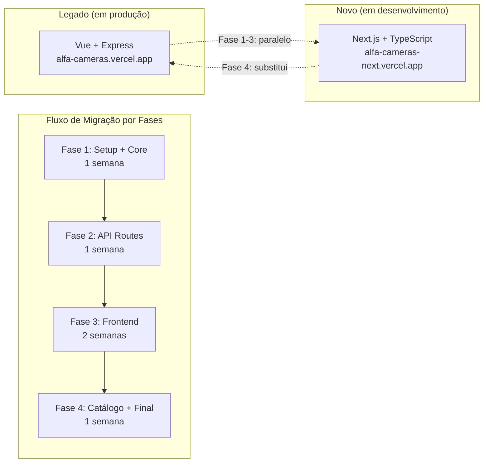

# Fluxo de Arquitetura Geral

```mermaid
flowchart TB
    subgraph "Navegador"
        Browser[Usuário]
    end

    subgraph "Vercel"
        direction TB
        NextApp["Next.js App<br/>(App Router)"]
        
        subgraph "Páginas (Server Components)"
            Dashboard
            Catalogo
            OrcamentosLista
            Clientes
        end
        
        subgraph "Páginas (Client Components)"
            NovaProposta
            Login
            Planos
        end
        
        subgraph "API Routes"
            AuthAPI["/api/auth/*"]
            OrcamentosAPI["/api/orcamentos/*"]
            ProdutosAPI["/api/produtos"]
            PlanosAPI["/api/planos"]
            CRMAPI["/api/crm"]
        end
        
        NextApp --> Dashboard
        NextApp --> Catalogo
        NextApp --> OrcamentosLista
        NextApp --> NovaProposta
        NextApp --> Login
        NextApp --> Planos
        NextApp --> Clientes
        
        NovaProposta --> OrcamentosAPI
        Login --> AuthAPI
        Planos --> PlanosAPI
    end
    
    subgraph "Lib compartilhada"
        DB["lib/db.ts<br/>(PostgreSQL Pool)"]
        Auth["lib/auth.ts<br/>(JWT)"]
        Telegram["lib/telegram.ts"]
        RDStation["lib/rdstation.ts"]
        WhatsApp["lib/whatsapp.ts"]
        Logger["lib/logger.ts"]
    end
    
    subgraph "Serviços Externos"
        PG[("PostgreSQL<br/>(Neon)")]
        TG[Telegram Bot API]
        RD[RD Station CRM]
    end
    
    OrcamentosAPI --> Auth
    OrcamentosAPI --> DB
    AuthAPI --> Auth
    ProdutosAPI --> DB
    PlanosAPI --> DB
    CRMAPI --> RDStation
    
    DB --> PG
    Telegram --> TG
    RDStation --> RD
    
    WhatsApp --> Browser
```

```mermaid
flowchart LR
    subgraph "Fluxo de Migração por Fases"
        F1["Fase 1: Setup + Core<br/>1 semana"] --> F2["Fase 2: API Routes<br/>1 semana"]
        F2 --> F3["Fase 3: Frontend<br/>2 semanas"]
        F3 --> F4["Fase 4: Catálogo + Final<br/>1 semana"]
    end
    
    subgraph "Legado (em produção)"
        Vue["Vue + Express<br/>alfa-cameras.vercel.app"]
    end
    
    subgraph "Novo (em desenvolvimento)"
        Next["Next.js + TypeScript<br/>alfa-cameras-next.vercel.app"]
    end
    
    Vue -.->|"Fase 1-3: paralelo"| Next
    Next -.->|"Fase 4: substitui"| Vue
```
